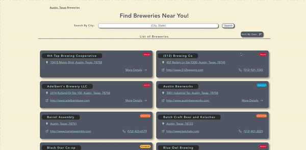

<h1 align="center">BreweryFinder</h1>

Using OpenBreweryDB API, this single page React Application displays breweries in Austin, Texas and  allows you to search any brewery by "city, state"

Visit the <a href="https://thebreweryfinder.netlify.app/">BreweryFinder App</a> deployed using Netlify

    

## Viewing the Application

* View the Application by cloning it and then running "npm run dev"

## Key Features

* Search Breweries by "city, state"
* Sort Breweries by type
* View Individual Details of a Brewery 
* Visit Brewery Website
* Call Brewery
* Find Brewery Location on Map

This software uses the following technologies:

- [React](https://reactjs.org/)
- [Typescript](https://www.typescriptlang.org/)
- [Sass](https://sass-lang.com/)
- [Netlify](https://www.netlify.com/)
- [Leaflet](https://leafletjs.com/)

<h2>Contact Me:</h2>
<a href="https://www.linkedin.com/in/zachcar">LinkedIn</a>
